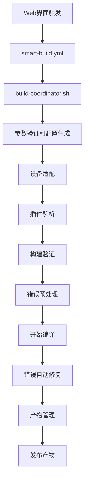

# OpenWrt智能编译项目重构方案

## 🎯 重构目标

1. **简化主工作流**: `smart-build.yml`专注于编译调度，减少复杂逻辑
2. **模块化架构**: 建立清晰的脚本分工和标准接口
3. **参数精确传递**: 确保web端配置准确传递到编译过程
4. **扩展性设计**: 便于功能扩展和维护
5. **错误处理**: 完善的异常处理和自动修复机制

## 🏗️ 重构后的架构设计

```
📁 项目根目录
├── 📁 .github/workflows/
│   └── 📄 smart-build.yml                    # 主工作流（大幅简化）
├── 📁 script/
│   ├── 📄 build-coordinator.sh               # 🆕 构建协调器（新主控脚本）
│   ├── 📄 config-generator.sh                # 🔄 配置生成器（重构）
│   ├── 📄 plugin-resolver.sh                 # 🔄 插件解析器（重构）
│   ├── 📄 device-adapter.sh                  # 🆕 设备适配器
│   ├── 📄 build-validator.sh                 # 🆕 构建验证器
│   ├── 📁 modules/                           # 🆕 模块化脚本目录
│   │   ├── 📄 env-checker.sh                # 环境检查模块
│   │   ├── 📄 source-manager.sh             # 源码管理模块
│   │   ├── 📄 error-handler.sh              # 错误处理模块
│   │   └── 📄 artifact-manager.sh           # 产物管理模块
│   └── 📁 fixes/                             # 现有修复脚本目录
│       ├── 📄 fix-coordinator.sh             # 🆕 修复协调器
│       └── 📄 ...                            # 现有修复脚本
├── 📁 config/                                # 配置文件目录
│   ├── 📄 build-templates/                   # 🆕 构建模板
│   ├── 📄 device-profiles/                   # 🆕 设备配置文件
│   └── 📄 plugin-mappings/                   # 🆕 插件映射配置
└── 📁 web/                                   # Web界面（保持不变）
    └── 📄 js/wizard.js
```

## 🔧 核心设计原则

### 1. 单一职责原则
- **smart-build.yml**: 仅负责编译流程调度和GitHub Actions生命周期管理
- **build-coordinator.sh**: 作为脚本层的总协调器，处理参数验证和模块调用
- **各功能模块**: 专注于特定功能，接口标准化

### 2. 标准化接口设计
所有脚本都遵循统一的调用标准：
```bash
./script_name.sh [operation] --config <config_file> [options...]
```

### 3. 配置驱动架构
- 使用JSON配置文件驱动整个构建过程
- 配置文件包含web端传来的所有参数
- 支持配置验证和自动修复

## 📋 重构实施计划

### 阶段一：核心架构重构（核心文件）
1. 创建 `build-coordinator.sh` - 新的主控脚本
2. 重构 `smart-build.yml` - 大幅简化主工作流
3. 设计统一的配置接口和参数传递机制

### 阶段二：模块化重构（功能分离）
1. 重构 `config-generator.sh` - 配置生成标准化
2. 重构 `plugin-resolver.sh` - 插件解析优化
3. 创建 `device-adapter.sh` - 设备适配逻辑
4. 创建 `build-validator.sh` - 构建验证机制

### 阶段三：增强功能模块（扩展性）
1. 创建模块化的功能脚本
2. 完善错误处理和自动修复
3. 优化产物管理和发布流程

## 🎨 重构后的工作流程



## 💫 重构优势

1. **维护性**: 模块化设计，单个问题只需修改对应模块
2. **扩展性**: 新功能以模块形式添加，不影响核心流程
3. **可靠性**: 标准化接口和配置验证，减少错误
4. **调试性**: 清晰的日志和错误追踪
5. **复用性**: 模块可以独立测试和复用

## 🚀 立即开始

接下来我将为您创建重构后的核心文件：
1. 简化版的 `smart-build.yml`
2. 新的 `build-coordinator.sh` 主控脚本
3. 重构的配置生成和插件解析脚本
4. 模块化的功能脚本

这个重构方案将显著提高项目的可维护性和扩展性，同时确保编译的准确性和成功率。